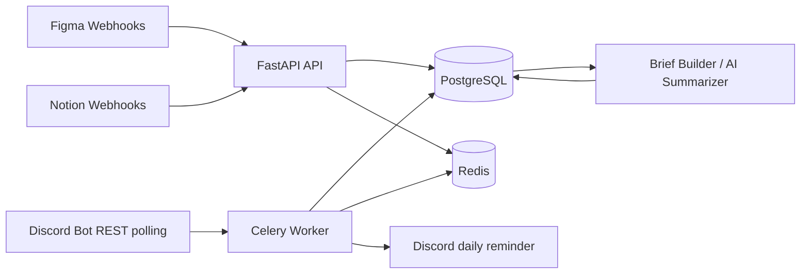

# TeamPulse Architecture

## Product Policy

TeamPulse is a read-only synthesis layer over project tools. The MVP collects selected Figma, Notion, and Discord material, turns it into normalized source items, generates a daily project brief, and requires unanimous team approval before marking the brief confirmed.

Source systems remain authoritative. TeamPulse does not modify Figma, Notion, Discord, GitHub, or Slack in the MVP.

## Main Decisions

- Modular monolith: API, worker, and scheduler share one Python codebase.
- Provider connectors are isolated under `teampulse.connectors`.
- All provider data becomes a common `SourceItem`.
- Brief generation is separate from ingestion and approval.
- AI claims must carry source references and a status: confirmed, AI inference, conflict, or needs confirmation.
- Revision approval snapshots active members when a revision is created. Membership changes require creating a superseding revision.
- Editing a brief creates a new revision hash and supersedes the previous pending draft.
- Credentials are encrypted before database storage; production key custody must use a KMS or secret manager.

## Runtime Components

## Ingestion Flow

1. A provider webhook or polling job receives source activity.
2. Provider-specific connector verifies the request or credentials.
3. Connector normalizes data into `SourceItem`.
4. `SourceItem` is inserted idempotently by `(provider, external_id)`.
5. The daily brief job reads source items for a project/time window.
6. The brief builder creates a new `BriefRevision` with source citations.
7. The active member list is snapshotted into `approver_snapshot`.
8. TeamPulse sends one Discord reminder for the pending revision.
9. Members approve the exact revision hash.
10. When all snapshotted members approve, the revision becomes confirmed.

## Connector Notes

Figma:

- Official docs: https://developers.figma.com/docs/rest-api/webhooks/
- Relevant webhook events: `FILE_UPDATE`, `FILE_COMMENT`, `FILE_VERSION_UPDATE`.
- Webhook security uses a passcode in the payload.
- Required read scopes include `file_content:read` and `file_comments:read`; `webhooks:write` is needed to create/manage webhooks.
- Webhooks require suitable team/project/file permissions.

Notion:

- Official docs: https://developers.notion.com/reference/webhooks
- Webhook setup sends a one-time `verification_token`; subsequent events include `X-Notion-Signature`.
- The integration needs read content and read comments capabilities for selected pages/databases.
- The connection only sees resources explicitly shared with it.

Discord:

- Official docs: https://docs.discord.com/developers/resources/message
- Channel history requires `VIEW_CHANNEL` and `READ_MESSAGE_HISTORY`.
- Sending reminders requires `SEND_MESSAGES`.
- Message content can be empty unless the app is allowed to access message content under Discord's policy.
- Discord is modeled as bot REST polling plus outbound reminder messages, not as a generic incoming webhook.

## AI Boundary

The current code ships with `StructuredBriefBuilder`, a deterministic fallback that preserves the brief contract for tests and local demos. A production AI summarizer should be added behind the same boundary and must keep these guarantees:

- no claim without source IDs unless explicitly unsupported;
- all inferred claims labeled `ai_inference`;
- conflicts surfaced, not silently resolved;
- generated output stored as a draft until unanimous approval.

## Security and Privacy

- Source collection is opt-in per project.
- External credentials are encrypted at rest via Fernet for local MVP.
- Production must move encryption key custody out of app environment variables.
- Discord collection needs channel/member consent and retention policy before pilot use.
- The MVP uses a temporary member-id header for approvals; production needs real auth.
